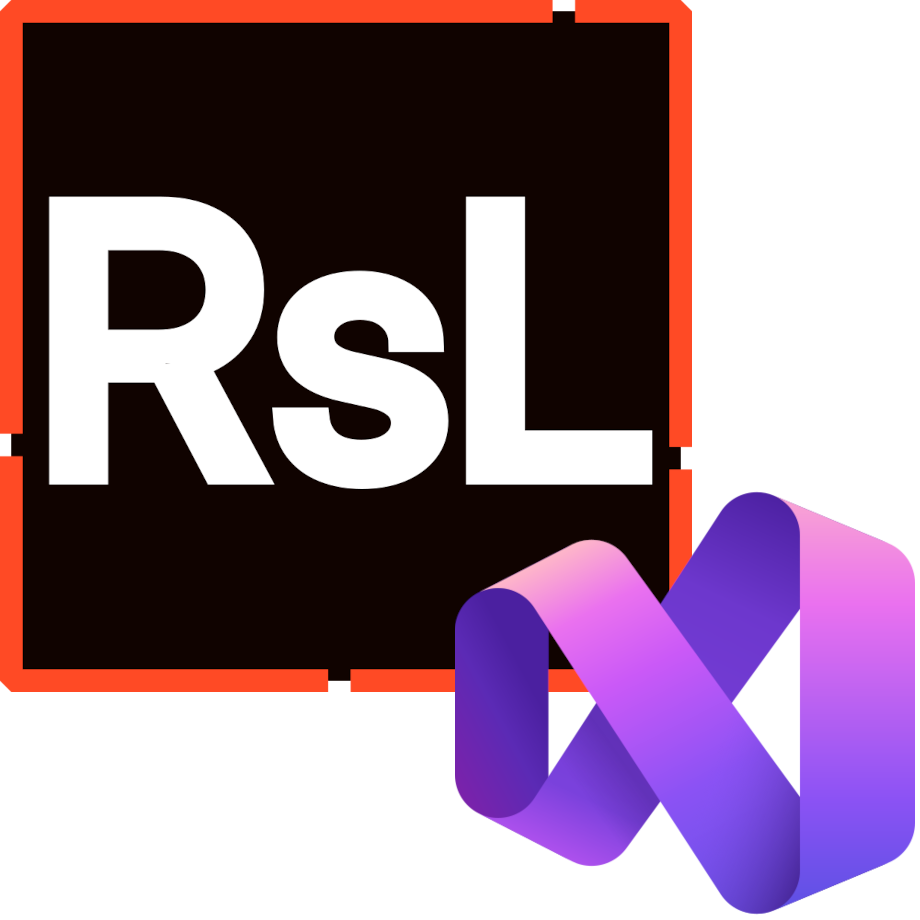

  

	

<h1 align="center">RSML Support for Visual Studio</h1>

***

> [!NOTE]
> This extension is currently in preview. Some features might not be working exactly as intended, and some features might be missing. Please report any bugs you find to this repository: it would help us immensely.

**RSML Support for Visual Studio** is a free and open-source Visual Studio extension that adds several features to Microsoft's IDE that allow developers using RSML to take it to another level.

## Current Features
- [X] Syntax Highlighting

## Planned Features
- [ ] Evaluate RSML from within Visual Studio (current host, default common hosts and custom host)
- [ ] "Lightbulb" actions (IntelliSense suggestions)
- [ ] Visual editor for RSML (designer)

***

**Copyright (c) 2025 OceanApocalypse**

We :heart: open-source!

